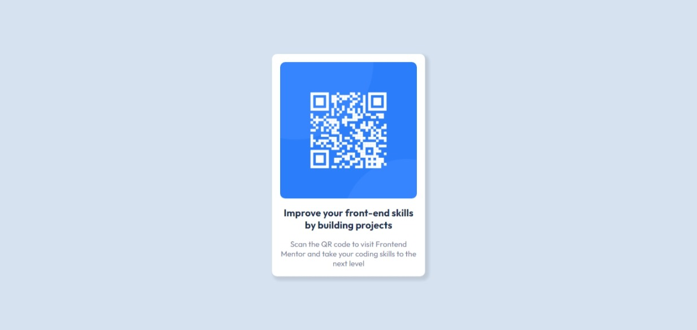

# Frontend Mentor - QR code component solution

This is a solution to the [QR code component challenge on Frontend Mentor](https://www.frontendmentor.io/challenges/qr-code-component-iux_sIO_H).

## Table of contents

- [Overview](#overview)
  - [Screenshot](#screenshot)
  - [Links](#links)
- [My process](#my-process)
  - [Built with](#built-with)
  - [What I learned](#what-i-learned)
- [Author](#author)

## Overview

I made this project with just HTML and CSS, to get started with Frontend Mentor.

### Screenshot

### Links

- Solution URL: **[Code](https://github.com/CMRicardo/qr-code)**
- Live Site URL: **[Live site](https://qr-code-cmricardo.vercel.app/)**

## My process

### Built with

- Semantic HTML5 markup
- CSS custom properties
- CSS Grid
- Mobile-first workflow

### What I learned

I learned how to participate in the Frontend Mentor community.

## Author

- Website - [CMRicardo](https://github.com/CMRicardo)
- Frontend Mentor - [@CMRicardo](https://www.frontendmentor.io/profile/CMRicardo)
- Twitter - [@RichardCM](https://www.twitter.com/RichardCM)
